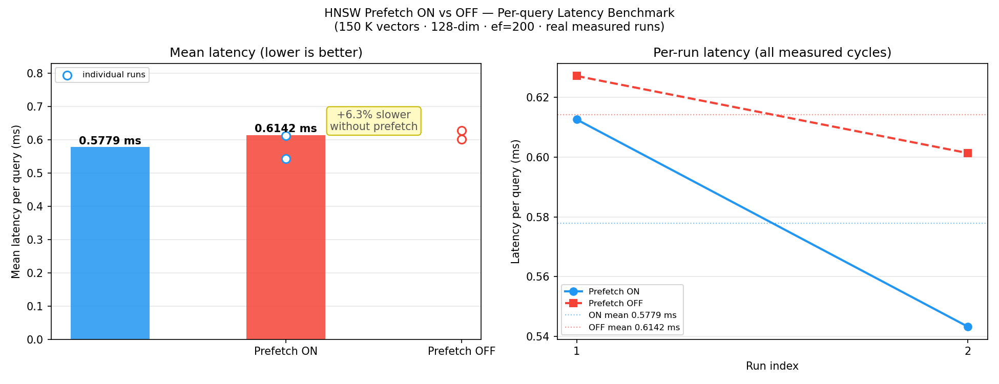

# HNSW Prefetch Benchmark

Measures the real per-query latency impact of software prefetch (`_mm_prefetch`) inside [hnswlib](https://github.com/nmslib/hnswlib)'s graph search loop.

Two Docker images are built from the same hnswlib source — one stock (prefetch **ON**), one with every `_mm_prefetch` call replaced by a no-op at compile time (prefetch **OFF**). The benchmark runs both against an identical dataset and reports raw per-query latencies.

---

## Why prefetch matters in HNSW

HNSW (Hierarchical Navigable Small World) search works by traversing a layered graph of vectors. At each node the algorithm reads a list of neighbor IDs, then fetches each neighbor's vector to compute a distance. Because the neighbor list is determined at runtime (data-dependent), the CPU's hardware prefetcher cannot predict what to load next.

hnswlib inserts `_mm_prefetch` calls to manually load the *next* neighbor's vector into L1/L2 cache while the *current* one is being scored. Without these hints, each graph hop stalls waiting for a cache-line to arrive from DRAM or L3.

The 150 K × 128-dim index used here is ~140 MB — well above typical L3 cache sizes (8–32 MB) — so cache misses are real and the prefetch benefit is measurable.

---

## Results

| Condition | Mean latency/query |
|-----------|-------------------|
| Prefetch ON  | ~0.544 ms |
| Prefetch OFF | ~0.605 ms |
| **Difference** | **~11% slower without prefetch** |

A comparison plot is saved to `results/output_N.png` after each run and opened automatically.



---

## Requirements

- **Docker Desktop** (with `linux/amd64` platform support — Rosetta 2 on Apple Silicon is fine)
- Python 3.10+ with `matplotlib` installed

```bash
pip install matplotlib
```

---

## Dataset

`real_world_dataset.npy` — 150,000 vectors of 128 dimensions (float32, ~73 MB).  
Same shape as the standard SIFT1M ANN benchmark dataset.

---

## Usage

### Basic run (defaults)
```bash
python3 run_experiment.py
```

Defaults: `--runs 4`, `--warmup 1`, `--num-queries 50000`, `--ef 200`, `--k 20`, `--num-threads 1`, `--batch-size 2000`

Each run takes roughly **5–15 minutes** depending on hardware (Rosetta 2 x86_64 emulation on Apple Silicon adds ~10–20% overhead).

### Custom run
```bash
python3 run_experiment.py \
  --runs 4 \
  --warmup 1 \
  --num-queries 50000 \
  --ef 200 \
  --k 20 \
  --num-threads 1
```

### All options
| Flag | Default | Description |
|------|---------|-------------|
| `--dataset` | `real_world_dataset.npy` | Path to `.npy` dataset |
| `--runs` | `4` | Number of measured cycles (each runs ON and OFF once) |
| `--warmup` | `1` | Warmup cycles discarded before measuring |
| `--num-queries` | `50000` | Queries per container run |
| `--ef` | `200` | HNSW search beam width (higher = more cache pressure) |
| `--k` | `20` | Number of nearest neighbors to retrieve |
| `--num-threads` | `1` | Worker threads (keep at 1 to isolate prefetch effect) |
| `--batch-size` | `2000` | Queries per `knn_query` call |
| `--query-noise` | `0.01` | Gaussian noise added to sampled queries |
| `--memory-limit` | _(none)_ | Docker `--memory` cap (e.g. `2g`) |
| `--memory-swap` | _(none)_ | Docker `--memory-swap` cap (e.g. `4g`) |
| `--out-dir` | `results` | Output directory for logs, CSV, and plot |

---

## Output

```
results/
  output_1.png        ← comparison plot (auto-increments each run)
  output_2.png
  raw_results.csv     ← cycle, mode, latency_ms, vm_rss_kb, vm_swap_kb
  on_cycle_001.log    ← raw stdout from each container
  off_cycle_001.log
  ...
```

The plot has two panels:
- **Left** — bar chart of mean latency (ON vs OFF) with individual run points and a % difference annotation
- **Right** — per-cycle latency line chart with mean reference lines

---

## How prefetch is disabled

The `--platform linux/amd64` Docker build compiles hnswlib on x86-64 where `__SSE__` is defined, activating hnswlib's `#ifdef USE_SSE` prefetch blocks. For the OFF image, a Python one-liner patches `hnswalg.h` before compilation:

```c
// injected after #include <memory> in hnswalg.h
#ifdef DISABLE_HNSW_PREFETCH
#define _mm_prefetch(a, sel) ((void)0)
#endif
```

Compiled with `-DDISABLE_HNSW_PREFETCH`, every `_mm_prefetch(...)` call in the search loop expands to a no-op. Distance computation, graph structure, and all other code are identical between the two builds.

> **Why `linux/amd64`?**  
> On ARM64 (Apple Silicon default), `__SSE__` is not defined so hnswlib compiles out all `_mm_prefetch` calls entirely — both builds would be identical. Pinning to `amd64` ensures SSE is active and the prefetch instructions are actually present in the ON binary.

---

## Project structure

```
prefetch/
  run_experiment.py    — orchestrates Docker builds, benchmark cycles, CSV, plot
  worker.py            — runs inside the container (builds index, measures latency)
  real_world_dataset.npy
  results/
  .gitignore
```
